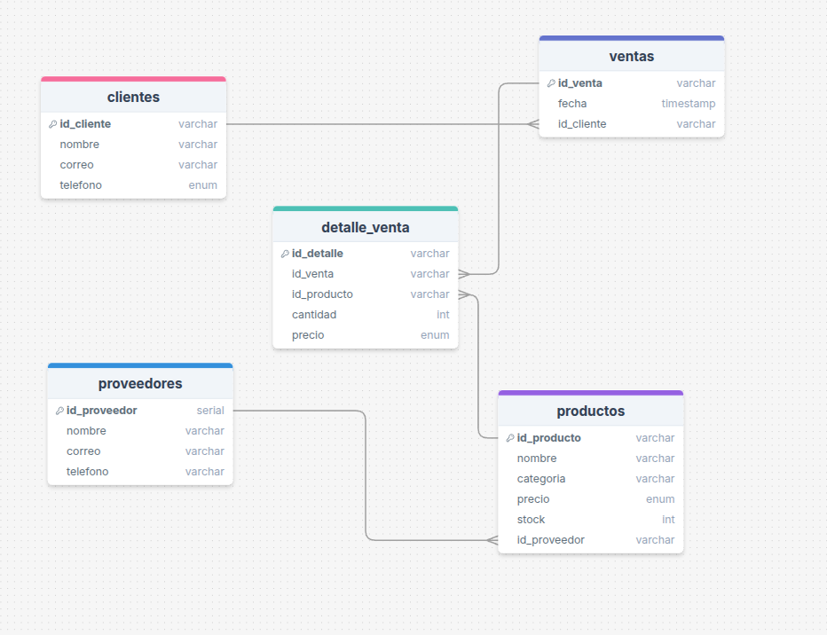

# **🏪 Gestión de Inventario para una Tienda de Tecnología**

La tienda **TechZone** es un negocio dedicado a la venta de productos tecnológicos, desde laptops y teléfonos hasta accesorios y componentes electrónicos. Lo que busca el proyecto es darle un mejor manejo a la base de datos de TechZone, para eso se hicieron optimizaciones que dieran un mejor flujo de datos y todo lo que conlleva esto.

### Imagen del modelo

## Como importar y/o ejecutar el proyecto

- Clonar el repositorio 
- Conectar la base de datos
- Ejecutar cada uno de los scripts de db.sql (creacion de la base de datos)
- Ejecutar cada uno de los scripts de insert.sql (inserccio de datos)

# Apuntes de clase 
[Apuntes] (https://github.com/kevinz-08/postgresql)